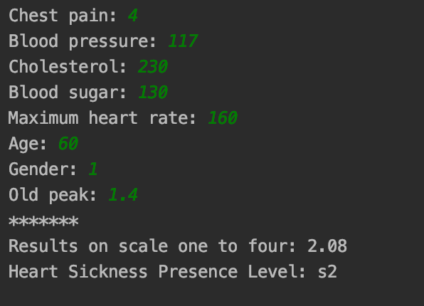

# Heart-Disease-Diagnoser
This project is a fuzzy expert system to determine the heart sickness presence level. It is implemented based on the paper "A fuzze expert system for heart disease diagnosis".
 
Reference:
Adeli, Ali, and Mehdi Neshat. "A fuzzy expert system for heart disease diagnosis." Proceedings of international multi conference of engineers and computer scientists, Hong Kong. Vol. 1. 2010.
 
(Detailed explanation could be observed in report.pdf in persian)
## An example 
The picture below is an example of an input and its corresponding output:

  

